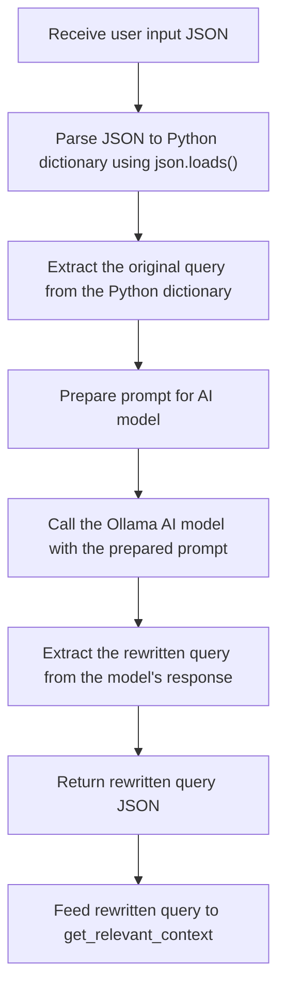

# Ollama based Retrieval-Augmented Generation

A project local retrieval-augmented gerenation solution leveraging Ollama and local reference content.

## Architecture components

- Conda
- Python 3.11
- Ollama
- LLama3.1
- mxbai-embed-large embedding model

## Setup

### Prerequisites

### Replcate code and setup environment

1. git clone https://github.com/johnaclouse/ollama-rag.git
2. cd dir
3. Install [Conda](https://github.com/conda-forge/miniforge#download) if not already present.
4. Create a conda environment: `conda create --name ollama-rag python=3.11
5. pip install -r requirements.txt
6. Install Ollama (https://ollama.com/download)
7. ollama pull llama3.1
8. ollama pull mxbai-embed-large
9. python upload.py (pdf, .txt, JSON)
10. python localrag.py (with query re-write)

## Automatic prompt engineering

Follow-up prompts are rewritten to incorporate the context returned by the first query.

### Latest Updates
   
### Reference

### RAG

### Ollama

## Citation

This project is based on code from https://github.com/AllAboutAI-YT/easy-local-rag. Thank you to Kris at AllAboutAI-YT for sharing this work.
